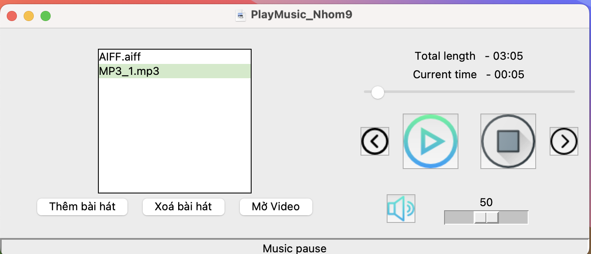

# Play Audio And Play Video

This is an application where you can add one or more of your favorite songs or videos that you want to watch. The application is designed based on Python's Pygame and Tkinter libraries. It allows you to adjust the volume when playing audio, skip tracks if you wish, you can fast forward to the part of the song you want, and finally, you can pause the audio when needed.

## Prerequisites

Before running the application, make sure you have installed the following dependencies:

- Python 3.x
- Tkinter
- Pygame
- OS
- Mutagen
- Time
- Threading
- OpenCV

You can install the dependencies using pip3 if your Python is version 3.x:

```
pip3 install pygame
pip3 install mutagen
pip3 install opencv-python-headless
```
## How to download and run the project

**Access GitHub:**
```
git clone https://github.com/hung573/PlayAudio_PlayVideo
```
**Go to the folder and download it:** 
```
cd PlayAudio_PlayVideo
```
**Run Application:** 
```
python main.py
```

```
```
**User manual** 
1. **Add, delete songs from the playlist, and select a video.**
- You click on the "Add Song" button and sequentially add your favorite audios.
- You select the song you don't like from the playlist and click the "Delete Song" button to remove it from the playlist.
- You click on the "Open Video" button and choose a video from your device to start playing it. To close the video, you can press "q".

2. **Play, pause, stop:**
- After you have added a playlist of songs, you can press the "Play" button to start playing the first song, or you can select a song from the playlist that you want to "Play" and start playing it.
- You can pause a song by clicking the "Pause" button and resume playing it by clicking the "Play" button.
- You can completely stop the song by clicking the "Stop" button.

3. **Skip to the next song:**
- You can skip to the next song by clicking the "Next" button.
- You can go back to the previous song by clicking the "Previous" button.

4. **Adjust the volume, and seek to a specific position in the audio.**
You can adjust the volume by dragging the volume up or down using the volume up and down buttons. Alternatively, you can mute the volume by clicking the "mute" button.
You can seek to a specific position in the audio by dragging the time slider.

5. **Error Handling::**
- If any errors occur during the process, error messages will be displayed in a pop-up window.

## Notes

- This application only supports playing audio and video files that have been downloaded and added to the playlist.
